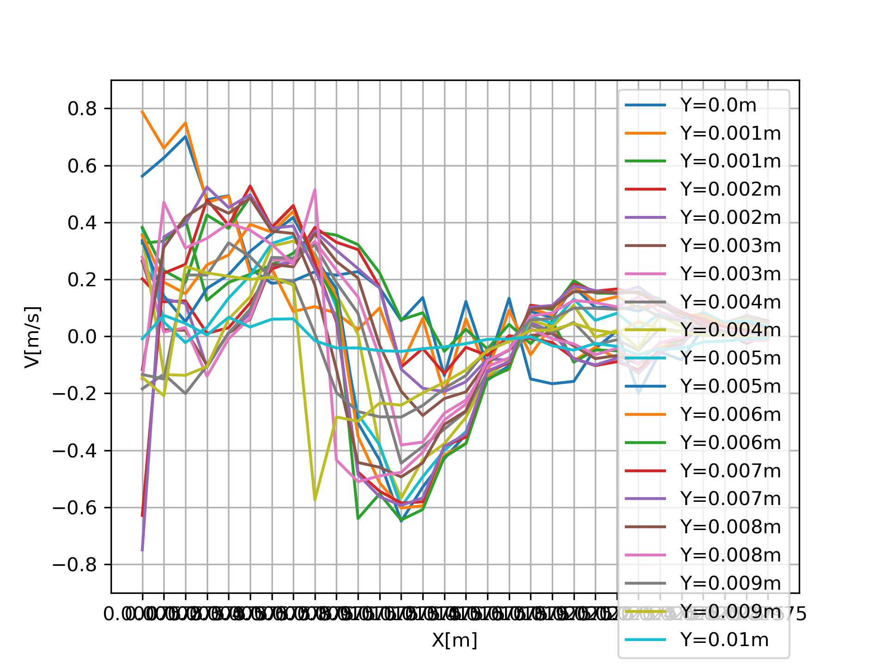

# PyCaFOAM personal 2d CFD solver
Content:
- CTD: computational thermodynamics (conduction solver)
- IncStePISO: incompressible steady state piso solver (SD version is using steepest descent as oppose to direct method in solving Ax=b)

### Fully developed viscous channel flow
Setup for this case can be found in IncStPISO.

OpenFOAM solution:

PyCaFOAM solution:

Also the v velocity and pressure: 

### Jet shear layer with air
Because did not implement rhie chow interpolation, currently suffer checker board problem

However, the development of shear layer can still be vaguely seen

Here are the U velocity V velocity and pressure:

### Jet shear layer with air and non-uniform grid
As can be seen checker board can be alleviated using nonuniform grid

### Problem suffered
- cannot accept reverse flow shows NaN big problem
- relies on non-uniform grid to kill the checker board problem
- advection is first order discretization, inconsistent with others
- mometum prediction is [U,V] solved together, higher cost then pressure correction, need to apply ADI

### Formulation
Structural grid is generated as follows

The four colors represents the mapping between cell --> starting vertex --> X direction face --> Y direction face

Here is a incompressible steady state equation to solve

Pressure and viscosity are both normalized by density
Pressure is also modeled as a source term in consistent with the pressure corrector equation (It does not matter if linear interpolation is used)

Formulation of advection term:

First order upwind 
Simultaneously for the sumPhi matrix which will be used to implement div(mom equ) later when deriving pressure correction equ

Formulation of diffusion term:

Linear interpolation used. Interpolation based on volume ratios

Formulation of pressure term:

Linear

Formulation of discretized momentum equation:

Formulation of PISO loop:

